- [1. Intro](#1-intro)
- [2. Part 1: The Frontend](#2-part-1-the-frontend)
  - [2.1. Add RockCommerce](#21-add-rockcommerce)
    - [2.1.1. (WIP) Installing](#211-wip-installing)
    - [2.1.2. Add It to the Frontend](#212-add-it-to-the-frontend)
  - [2.2. Add Products](#22-add-products)
    - [2.2.1. Create the Product Template](#221-create-the-product-template)
    - [2.2.2. Add a Product page](#222-add-a-product-page)
    - [2.2.3. Convert the Product Page into a RockCommerce Product](#223-convert-the-product-page-into-a-rockcommerce-product)
    - [2.2.4. Add Product Image and Description](#224-add-product-image-and-description)
  - [2.3. Add Cart Features to Products](#23-add-cart-features-to-products)
    - [2.3.1. Display Products in the Cart](#231-display-products-in-the-cart)
    - [2.3.2. Add the Missing Data](#232-add-the-missing-data)
    - [2.3.3. Populate the cart](#233-populate-the-cart)
- [3. Part 2: The Payment](#3-part-2-the-payment)
  - [3.1. Use Mollie as a Payment Service Provider](#31-use-mollie-as-a-payment-service-provider)
    - [3.1.1. Install RockMollie](#311-install-rockmollie)
  - [3.2. Processing the Payment](#32-processing-the-payment)
  - [3.3. The Thanks Page](#33-the-thanks-page)
- [4. Testing the shop](#4-testing-the-shop)
- [5. Source](#5-source)


# 1. Intro

The day has finally arrived! You need to build an ecommerce site. You’ve never done it before, but obviously, as the ProcessWire lover you are, there’s no way you’re Shopify-ing or Magento-ing your way into this. Nope, you want to do it yourself.  

What if I told you (*crescendo music kicks in*) you could create a shop, right here, right now, in less than an hour? 

Introducing: 
[RockCommerce](https://www.baumrock.com/en/processwire/modules/rockcommerce/), the ProcessWire way to do ecommerce.  


Jokes aside, yeah, we’re building a shopping cart using the brand-new, shiny, and absolutely lovely Bernhard module. Here’s what we’ll do:

- **Frontend Store:** The interface to display, add, and remove products.
- **Payment:** And yes, we’ll process the cart products and handle the payment.

To start, please [create a fresh ProcessWire installation](https://processwire.com/docs/start/install/new/) using the blank profile. 
Once you're done, come back here.  


# 2. Part 1: The Frontend  

The first step will be to set up the skeleton of our store, where we'll display the products and the cart. 

For this demo, we’ll use [UIkit](https://getuikit.com/docs/introduction) to quickly style the store. Of course, you’re free to use your favorite styling framework (*cough* Tailwind) or even some custom old-fashioned CSS .  

Now, open `site/templates/home.php`, paste and save the following:  

```html
<?php namespace ProcessWire; ?>

<!doctype html>
<html lang="en">
  <head>
    <meta charset="UTF-8" />
    <meta name="viewport" content="width=device-width, initial-scale=1.0" />
    <!-- UIkit CSS -->
    <link rel="stylesheet" href="https://cdn.jsdelivr.net/npm/uikit@3.21.16/dist/css/uikit.min.css" />
    <!-- UIkit JS -->
    <script src="https://cdn.jsdelivr.net/npm/uikit@3.21.16/dist/js/uikit.min.js"></script>
    <script src="https://cdn.jsdelivr.net/npm/uikit@3.21.16/dist/js/uikit-icons.min.js"></script>
    <!-- Paste RockCommerce JS here -->
    
  </head>
  <body>
    <header class="uk-navbar-container uk-padding-small">
      <nav class="uk-container uk-container-small uk-flex ">
        <div class="uk-navbar-left uk-text-bolder">🚀👕 RockTees</div>
        <div class="uk-navbar-right">
          <a href="#" class="uk-text-primary"> 
            <span uk-icon="icon: bag"></span> Cart items: X
          </a>
        </div>
      </nav>
    </header>

    <main>
      <div class="uk-container uk-container-small uk-section">
        
        <div class="uk-grid uk-grid-column-medium">
        
          <!-- Products region -->
          <div id="products" class="uk-width-2-3">Products</div>
          
          <!-- Cart region -->
          <div class="uk-width-1-3">
            <div id="cart" class="uk-card uk-card-default uk-card-body">
              Cart
            </div>
          </div>
          
        </div>
      </div>
    </main>
    
  </body>
</html>

```

Nothing fancy here: We’re including UIkit in our head and defining the HTML skeleton with two regions:  the _products_, and the _cart_. 

But, to get a better sense of how our shop will look, let's replace the content inside the `main` tag with some placeholder content:

```html
<main>
  <div class="uk-container uk-container-small uk-section">
    
    <div class="uk-grid uk-grid-column-medium">
    
      <!-- Products region -->
      <div id="products" class="uk-width-2-3">
        <div class="uk-grid uk-grid-medium uk-child-width-expand">
          <div>
            
            <h2>Product title</h2>
            <p>Product description.</p>
            <p><strong>€ 30,00</strong></p>
            <a class="uk-button uk-button-primary" href="">Add to cart</a>
          </div>
        </div>
      </div>
      
      <!-- Cart region -->
      <div class="uk-width-1-3">
        <div id="cart" class="uk-card uk-card-default uk-card-body">
          <p>Products added: x</p>
          <p>Subtotal € 0,00</p>
        </div>
      </div>
    
    </div>
  </div>
</main>
```

Your current setup should look something like this:  

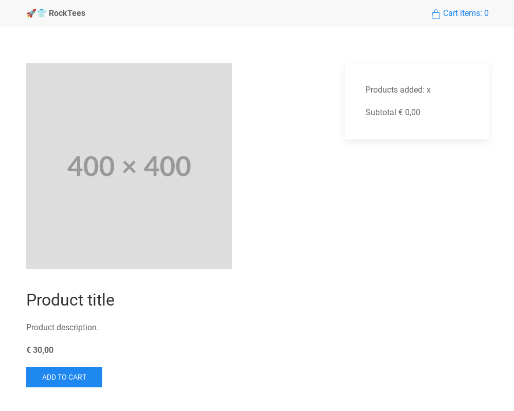  

---

## 2.1. Add RockCommerce

### 2.1.1. (WIP) Installing
install rockcommerce, go to modules etc....

### 2.1.2. Add It to the Frontend  

With RockCommerce and its dependencies installed, we're just one step away from using it. In your `site/templates/home.php` add this script at the end of the `head` tag instead of the `<!-- Paste RockCommerce JS here -->` message:  

```html
<script
    src="<?= $config->urls->siteModules ?>RockCommerce/dst/RockCommerce.min.js"
    defer></script>
```

Now, to test if it’s working, update the _Cart items: 0_ line in the `header` tag with this one, which includes the magic attribute `rc-cart-count`. This attribute helps us display how many products have been added to the cart:  

```html
<span uk-icon="icon: bag"></span> Cart items: <span rc-cart-count></span>
```

Head to your browser, and if you see `Cart items: 0`, congratulations, we’re set! If not... well, go back and check what you missed. That’s the charm of tutorials, isn’t it?

So, *What’s happening here?* In a nutshell, RockCommerce sets up endpoints on our website to handle products, carts, and orders. Then in the frontend it uses [Alpine](https://alpinejs.dev/) as a bridge to give us access to whatever product, cart, or order info we need.

This means the logic, flow and the interface are all up to us! It’s not one of those boxed, ready-to-go solutions where you have to hammer things here and there to make it fit your needs.

**Disclaimer:** That’s how I understand RockCommerce—it doesn’t mean it’s the official explanation. Hopefully, I’m not wrong! 😅

So, now that we have the pasta, let's add some salsa:


## 2.2. Add Products  

Unilaterally, I’ve decided we’re going to sell T-Shirts. Let’s set the foundation for our T-Shirt products by creating a product template.  

### 2.2.1. Create the Product Template  

1. Go to **Setup > Templates > Add New**.  
2. Type `product` as the name of the template and click **Add Template**.  

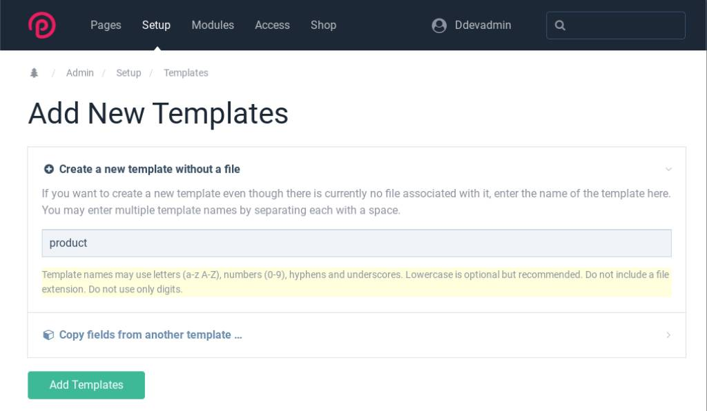  

---

### 2.2.2. Add a Product page 

1. Head to the homepage of the admin panel and, in the page tree, click **Home > New**.  

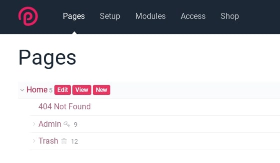  

2. Select the template `product`, give the page the title **Black T-Shirt**, and hit **Save + Publish**.  

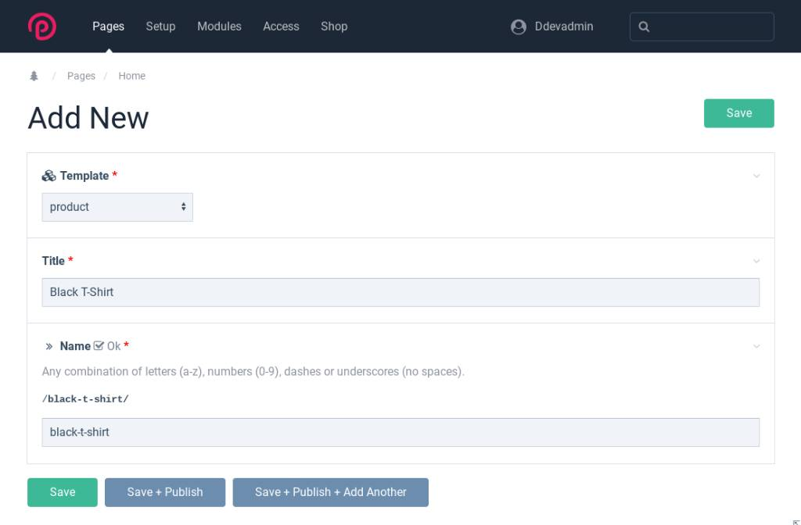  


### 2.2.3. Convert the Product Page into a RockCommerce Product

To convert our product page into a RockCommerce product, we will use a Custom Page Class and the `\RockCommerce\Product` trait.

First, create a new file and copy this code into it. Save the file as `site/classes/ProductPage.php`:

```php
<?php

namespace ProcessWire;

class ProductPage extends Page
{
  use \RockCommerce\Product;
}
```

> Tip: [Custom Page Classes](https://processwire.com/blog/posts/pw-3.0.152/#new-ability-to-specify-custom-page-classes) let us interact with pages in a more organized and _classy way_—pun intended—by introducing Object-Oriented Programming. Without them, we (or just me?) end up dumping a bunch of logic and code into templates, making things messier and more complex.  
> If you're not using classes yet, I beg you: give them a try!


This Custom Page Class is connected to our product page template, which means any page using that template will automatically become a RockCommerce product.

To prove it:

1. Go to the ProcessWire admin and click `Modules > Refresh`.
2. Open your product page in the admin and check out the new `Shop` tab.

Congratulations—your product page is officially a RockCommerce product!

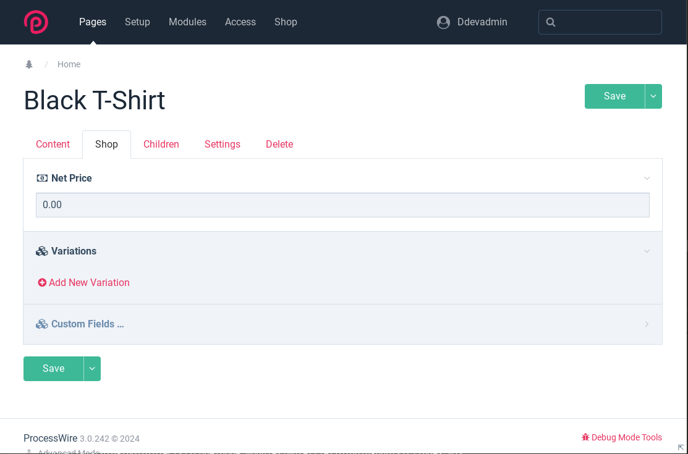  

---

### 2.2.4. Add Product Image and Description

The next thing to do is add an image and a description:

1. Go to `Setup > Fields > Add New`. Label it `Product Image` and choose `Single Image` for the field type.
2. Repeat the process for the description: Click `Setup > Fields > Add New`, label it `Product Description`, and select `Textarea` for the field type.

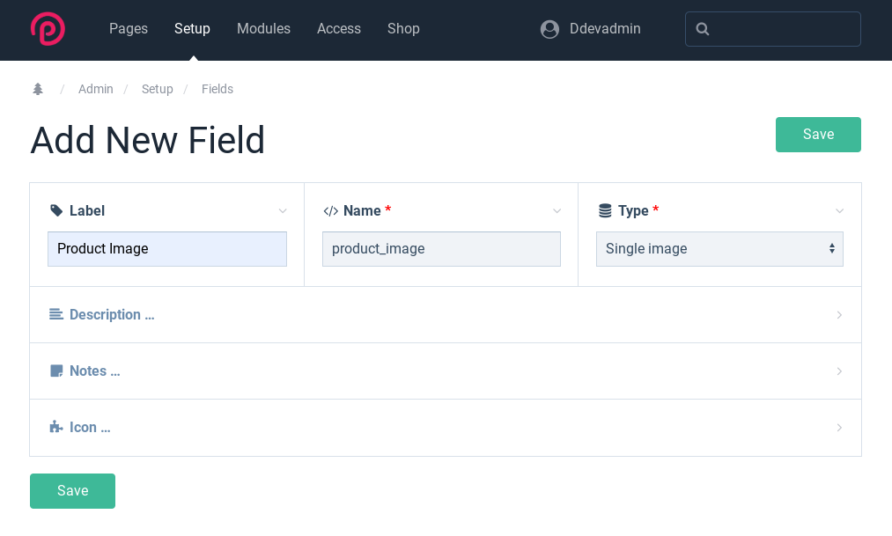


Next, add the new fields to the product template by clicking `Setup > Templates > Product` and selecting the fields using the `Add Field` selector.

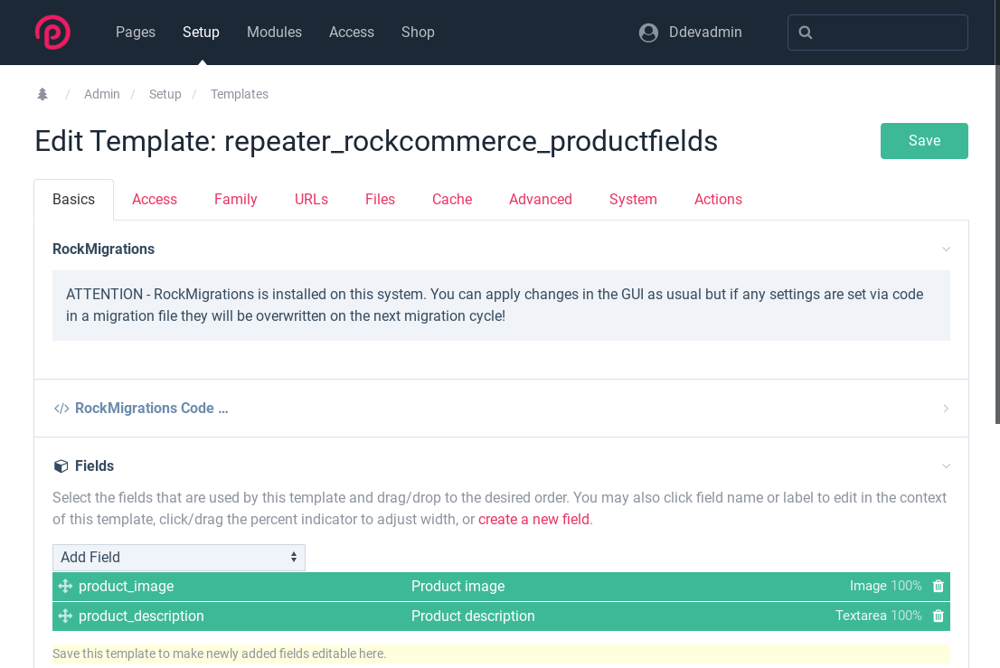


Now, go to the Black T-Shirt product page and add the image, description, and price:

- **Image:** Download this [T-shirt image](https://tailwindui.com/plus/img/ecommerce-images/product-page-01-related-product-01.jpg)
- **Description:** Classic black basic tee, soft cotton, versatile and timeless.
- **Price:** 30

> Tip: By default, the currency is set to Euro. To change it, go to `Modules > Site > RockMoney`.

Also, please create another product:

- **Title:** Aspen White T-Shirt
- **Description:** Clean white Aspen tee, soft cotton, perfect for any outfit.
- **Image:** [Aspen T-shirt](https://tailwindui.com/plus/img/ecommerce-images/product-page-01-related-product-02.jpg)
- **Price:** 40 (in the Shop tab)

Finally, hit `publish` (or the road Jack!).


## 2.3. Add Cart Features to Products

So far, we’ve got RockCommerce running and two shiny products ready to sell. To give our future customers a smooth, AJAX-like shopping experience, actions like adding/removing products, updating the cart, and navigating through checkout will be powered by **Alpine**. Luckily, RockCommerce handles most of the heavy lifting for us.

Let's start by replacing the placeholder content and loading real product data. 

Update the `Product` region in your `site/templates/home.php` file with the following:

```php
<!-- Products region -->
<div id="products" class="uk-width-2-3">
  <div class="uk-grid uk-grid-medium uk-child-width-expand">

    <?php foreach (pages('template=product') as $product): ?>
      <div <?= $product->rcAttributes() ?>>
        product_image->url ?>" />
        <h2><?= $product->title ?></h2>
        <p><?= $product->product_description ?></p>
        <p><strong><?= $product->rockcommerce_net ?></strong></p>
        <a class="uk-button uk-button-primary" href="#" @click='addToCart'>Add to cart</a>
      </div>
    <?php endforeach; ?>

    </div>
</div>
```

Now reload the homepage, try adding some products, and the counter will change. How cool is that?!

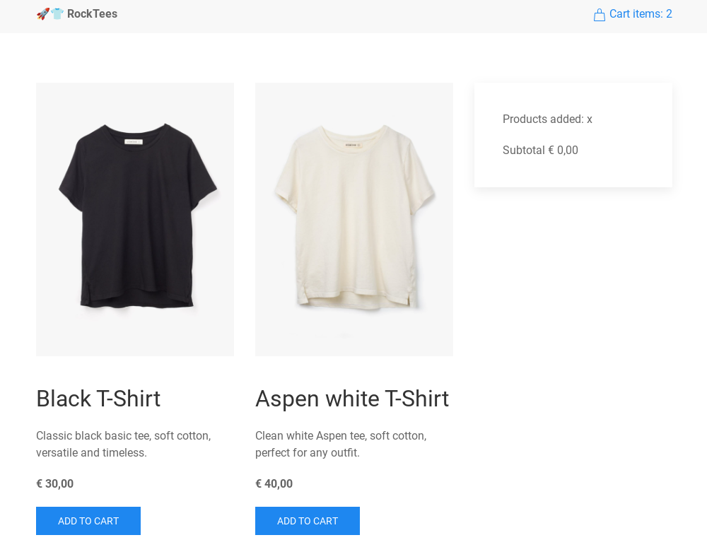


But hold your horses! Let’s review what’s happening here:

- We looped through all pages with the `product` template using `pages('template=product')` to display our two T-shirts.  
- For each product, we displayed its image, title, description, and price.  
- We addd the `$product->rcAttributes()` method to inject essential product data into each product `<div>` as attributes.  
- Finally, by using the `@click='addToCart'` dispatcher we made possible to add products to the cart with a single click.

Regarding  `rcAttributes()`—let me show you what it does. Right-click one of your T-shirts, inspect its code, and you’ll see something like this:  

```html
<div 
  x-data="RcProduct" 
  rc-pid="1034" 
  rc-price="30" 
  rc-minamount="1" 
  rc-maxamount="10" 
  rc-cid="1"
>
```

The `rcAttributes()` method dynamically injects product data that Alpine uses to handle the cart. So, when `@click='addToCart'` is triggered, it sends a request with that info to the `/rockcommerce/cart/add` endpoint, which in return updates the cart. That’s how our `rc-cart-count` counter increases!  

All of this happens just by adding `$product->rcAttributes()` and `@click='addToCart'` to our product. Neat!


### 2.3.1. Display Products in the Cart

Alright, so far, so good, but we’re missing the products in the cart. First, let’s add some markup to get an idea of how it’ll look:

```php
<!-- Cart region -->
<div class="uk-width-1-3">
  <div
    id="cart"
    class="uk-card uk-card-default uk-card-body"
    x-data="RcCart"
    rc-reload
  >
    <p>Products added: <span rc-cart-count></span></p>
    <template x-for="item in items">
      <div 
        x-init="console.log(item)"
        class="uk-flex uk-text-small">
        <div class="uk-width-1-4">
          
        </div>
        <div class="uk-width-3-4 uk-padding-small uk-padding-remove-top">
          Black T-Shirt x 1<br />
          € 30,00<br />
          <a href="#">remove</a>
        </div>
      </div>
    </template>
    <hr class="uk-divider-small" />
    <p>Subtotal € 0,00</p>
  </div>
</div>
```

Go to your browser, refresh the page, add some products, and bam, there they are! our products with fake content!  

I know that the UIkit classes and the product's fake description add a lot of visual noise, which could lead us to miss what’s important here, so let’s strip down the code and imagine it like this:

```html
<div
    x-data="RcCart" // Alpine component
    rc-reload       // Magic RockCommerce reload attribute
>
  <p>
    Products added: 
    <span rc-cart-count></span>       // Magic RockCommerce cart-count attribute
  </p>
  <template x-for="item in items">    // Loop for cart items  
    <div x-init="console.log(item)">  // Log item attributes 
      Cart items render here...
    </div>
  </template>
</div>
```

What we are doing is creating an _Alpine cart component_ `RcCart` and including the `rc-reload` magic attribute, which will reload cart data for us. Then, we loop through the `items` array, which contains the items added to our cart, so we can render each one.

And, as a bonus, we included `x-init="console.log(item)"` so we can peek inside each item. In other words, we are "opening the box" to understand which item properties are available and how we can render them.

Open the console, and you’ll see a `Proxy(Object)` for each T-shirt. Inside that object is all the product information Alpine can use to populate the cart. Since the cart is handled on the frontend, we’re not going to rely on PHP’s properties (e.g.: `$product->title`), like we did for the T-shirt display. Instead, with Alpine we can take care of rendering everything dynamically.  

Here’s an example of what the logged data looks like:

```json
{
    "id": 1053,
    "title": "Black T-Shirt",
    "description": "",
    "product": 1034,
    "amount": 1,
    "variation": "",
    "variationTableData": [],
    "url": "/black-t-shirt/#-amount:1",
    "shortUrl": "/black-t-shirt/",
    "pic": "",
    "itemNet": "€ 30,00",
    "itemVat": "€ 0,00",
    "itemGross": "€ 30,00",
    "totalNet": "€ 30,00",
    "totalVat": "€ 0,00",
    "totalGross": "€ 30,00"
}
```

Notice anything? Yes, the `pic` and `description` are empty! That’s because RockCommerce doesn’t know about our image or description fields… yet.  

But no worries— with Processwire _you are always just a hook away from the solution_!

### 2.3.2. Add the Missing Data  

Please create the file `site/rockcommerce.php` and add this hook:

```php
<?php namespace ProcessWire;

// Add a hook to modify the Items array
wire()->addHookAfter('Item::getJsonArray', function ($event) {
  $data = $event->return;

  // Get the product page using the ID in the data
  $product = wire()->pages->get($data['product']);
  if (!$product->id) {
    // Return if the product doesn't exist
    return;
  }

  if ($product->product_image) {
    // Add the product image URL if it exists
    $data['pic'] = $product->product_image->width(60)->url;
  }

  // Add the product description if it's available
  $data['description'] = $product->product_description ?? null;

  // Set the modified data back to the event return
  $event->return = $data;
});
```

Reload the page, add some products―if you done have any in your cart, and check your console. 
Now the cart data includes both image and description:

```json
{
    "id": 1053,
    "title": "Black T-Shirt",
    "description": "Classic black basic tee, soft cotton, versatile and timeless.",
    "product": 1034,
    "amount": 1,
    "variation": "",
    "variationTableData": [],
    "url": "/black-t-shirt/#-amount:1",
    "shortUrl": "/black-t-shirt/",
    "pic": "/site/assets/files/1034/product-page-01-related-product-01.60x0.jpg",
    "itemNet": "€ 30,00",
    "itemVat": "€ 0,00",
    "itemGross": "€ 30,00",
    "totalNet": "€ 30,00",
    "totalVat": "€ 0,00",
    "totalGross": "€ 30,00"
}
```

Before we move on, let me explain what we did here.

The `rockcommerce.php` file is a *hook file* provided by the module, where we can centralize all the hooks that modify RockCommerce's behavior.

> **Tip**: If you're not familiar with hooks, pause here and check out the [Using Hooks in ProcessWire](https://processwire.com/docs/modules/hooks/) documentation.

Since the item array doesn't include the `pic` and `description` data we need, we hooked into the `Item::getJsonArray` method and injected the image and description into the item array.

This way, when the array is returned, it will contain all the original information, along with our custom data. Lit!


### 2.3.3. Populate the cart

Now that we have all the info, we can get rid of the dummy content and pull the real item properties (`item.title`, `item.pic`, etc.):

```php
<!-- Cart region -->
<div class="uk-width-1-3">
  <div
    id="cart"
    class="uk-card uk-card-default uk-card-body"
    x-data="RcCart"
    rc-reload
  >
    <p>Products added: <span rc-cart-count></span></p>
    <template x-for="item in items">
      <div class="uk-flex uk-text-small">
        <div class="uk-width-1-4"></div>
        <div class="uk-width-3-4 uk-padding-small uk-padding-remove-top">
          <span x-text="`${item.title} x ${item.amount}`"></span><br />
          <span x-text="item.totalNet"></span><br />
          <a href="#" @click="deleteItem(item.id)">remove</a>
        </div>
      </div>
    </template>
    <hr class="uk-divider-small" />
    <p>Subtotal <span x-text="itemsNet"></span></p>
  </div>
</div>
```

Head to your browser and test it. Now, we can fully add products and delete them! 

And again, if we get rid of all the noise, the important thing we did was render the item properties, the cart total net `itemsNet`, and just like we did with `@click='addToCart'` to add products, we threw in the `@click="deleteItem(item.id)"` dispatcher to remove products without sweating.

```php
<template x-for="item in items">
  // item.pic
  
  // item.title + item.amount   
  <span x-text="`${item.title} x ${item.amount}`"></span>
  // item.title + item.totalNet   
  <span x-text="item.totalNet"></span>
  // deleteItem dispatcher
  <a href="#" @click="deleteItem(item.id)">remove</a>
</template>
//itemsNet
<p>Subtotal <span x-text="itemsNet"></span></p>
```

# 3. Part 2: The Payment

One of the things I feared most about the DIY e-commerce concept was: *Okay, how am I going to make payments work?*  

So, since our demo store is already displaying products, and we can add and remove them from the cart, we’re going to take a shortcut. Instead of building a full checkout form (where we’d obviously capture customer details like name and address), we are going to grab the bull by the horns, and jump straight to the payment! 

Olé!

Under the cart region, right below the `<p>Subtotal <span x-text="itemsNet"></span></p>` line, create a payment button that’s disabled when the cart is empty and enabled when products are added:

```html
<form method="post" action="/payment/">
  <button
    type="submit"
    :class="count ? 'uk-button-primary' : 'uk-button-default'"
    :disabled="!count"
    class="uk-button">
      Go to payment
  </button>
</form>
```

As you see, it’s a plain and simple form that doesn’t actually submit any data—it just triggers the `/payment/` page.

## 3.1. Use Mollie as a Payment Service Provider

For this demo, we’re going to integrate [Mollie](https://my.mollie.com/dashboard/signup) because it’s easy, and Bernhard already [created the module](https://processwire.com/talk/topic/30529-rockmollie-integrates-mollie-payments-into-processwire/).

1. Start by creating a Mollie account at [sign-up link](https://www.mollie.com/signup).
2. Click "Online payments."

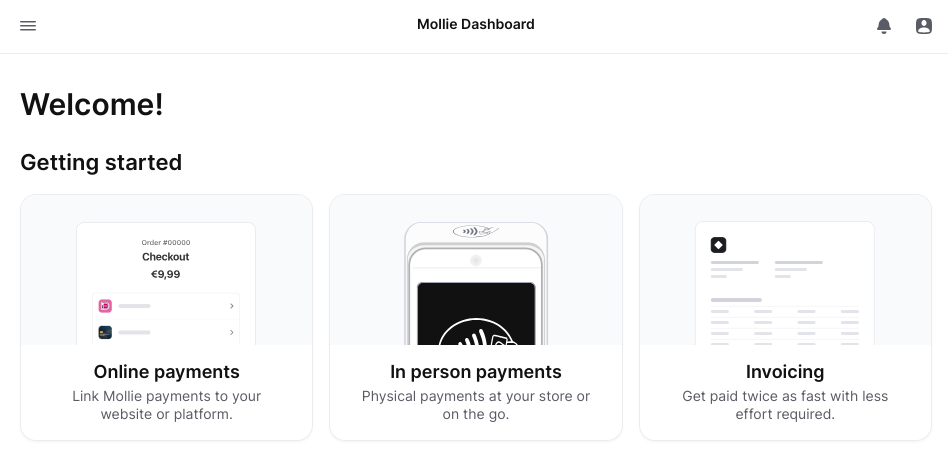

3. Copy the test key under "Test API key."

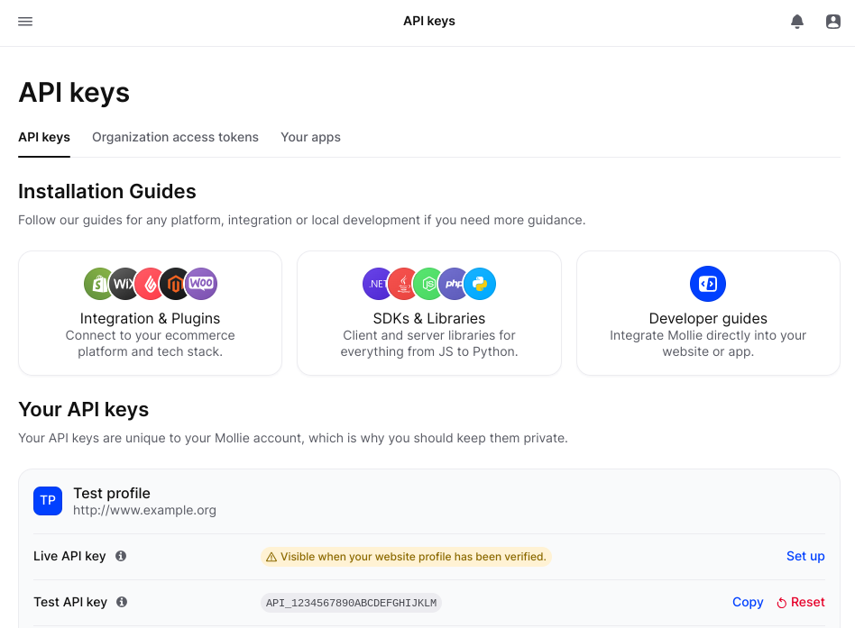

4. Add this to the end of your `site/config.php` file, making sure to replace `your API key` with the key you copied:

```php
$config->moduleInstall('download', 'debug');
$config->mollieApiKey = 'test_xxx'; //Paste your key here
```

### 3.1.1. Install RockMollie

1. Go to `Modules > New` in the ProcessWire admin.
2. Under `Add Module From Directory`, type `RockMollie`.
3. Click on `Get Module info`, then `Download Now`, and click on `Install Now`.

## 3.2. Processing the Payment

Okay, the logic here is pretty simple. When the customer hits the `Go to payment` button, we need to convert our cart products, into an order and pass the order information to Mollie so they can charge our customer. Then, Mollie will return the customer to our page and secretly pass us the hopefully-successful payment order information. 

Can you guess how much code we’d need to make that happen?

Go to your RocCommerce Hook file `site/rockcommerce.php` file and paste this after the hook we added early:

```php
// Add a hook to handle form submissions at the '/payment/' URL
wire()->addHook('/payment/', function ($event) {
  // Create a new order using RockCommerce cart
  $order = rockcommerce()->cart()->createOrder('New Order');

  // Create a payment for the order and set '/thanks/' as the redirect URL after payment
  $payment = $order->createPayment('/thanks/');

  // If the payment was successfully created, redirect to the checkout URL
  if ($payment) {
    wire()->session->redirect($payment->getCheckoutUrl());
  } else {
    throw new WireException('Payment creation failed.');
  }
});
```

And… that’s it. Really. 

As simple as that.

This hook is so simple, but powerful! First we intercept the URL `/payment/` request, using a [URL/Path hook](https://processwire.com/docs/modules/hooks/#url-path-hooks), so we dont need to create and extra payment page. Then we create a RockCommerce order, and with the order, we create a payment and pass `/thanks` as our redirection success page. And finally, we redirect the user to Mollie.

Here’s the [site/rockcommerce.php](./src/rockcommerce.php) version if you just want to copy and paste the whole code

## 3.3. The Thanks Page

And to finish, we are going to create a simple thanks page, by ripping of the layout of our Home page. Please create a new file `site/templates/thanks.php` and paste this:

```html
<?php namespace ProcessWire; ?>

<!doctype html>
<html lang="en">
  <head>
    <meta charset="UTF-8" />
    <meta name="viewport" content="width=device-width, initial-scale=1.0" />
    <!-- UIkit CSS -->
    <link rel="stylesheet" href="https://cdn.jsdelivr.net/npm/uikit@3.21.16/dist/css/uikit.min.css" />
    <!-- UIkit JS -->
    <script src="https://cdn.jsdelivr.net/npm/uikit@3.21.16/dist/js/uikit.min.js"></script>
    <script src="https://cdn.jsdelivr.net/npm/uikit@3.21.16/dist/js/uikit-icons.min.js"></script>
    <!-- RockCommerce JS -->
    <script
      src="<?= $config->urls
        ->siteModules ?>RockCommerce/dst/RockCommerce.min.js"
      defer
    ></script>
  </head>
  <body>
    <header class="uk-navbar-container uk-padding-small">
      <nav class="uk-container uk-container-small uk-flex ">
        <div class="uk-navbar-left uk-text-bolder">🚀👕 RockTees</div>
        <div class="uk-navbar-right">
          <a href="#" class="uk-text-primary"> 
            <span uk-icon="icon: bag"></span> Cart items: <span rc-cart-count></span>
          </a>
        </div>
      </nav>
    </header>
    <main>
      <div class="uk-container uk-container-small uk-section">
        <h1>Thanks a ton!</h1>
        <p>Your order will arrive in 2 hours. 🚀 We are FasTees than Amazon! 🛍️</p>
      </div>
    </main>
  </body>
</html>
```

Now, go to the ProcessWire admin, navigate to **Setup > Templates > Add New**, and ProcessWire will prompt you to add the `Thanks` template.  

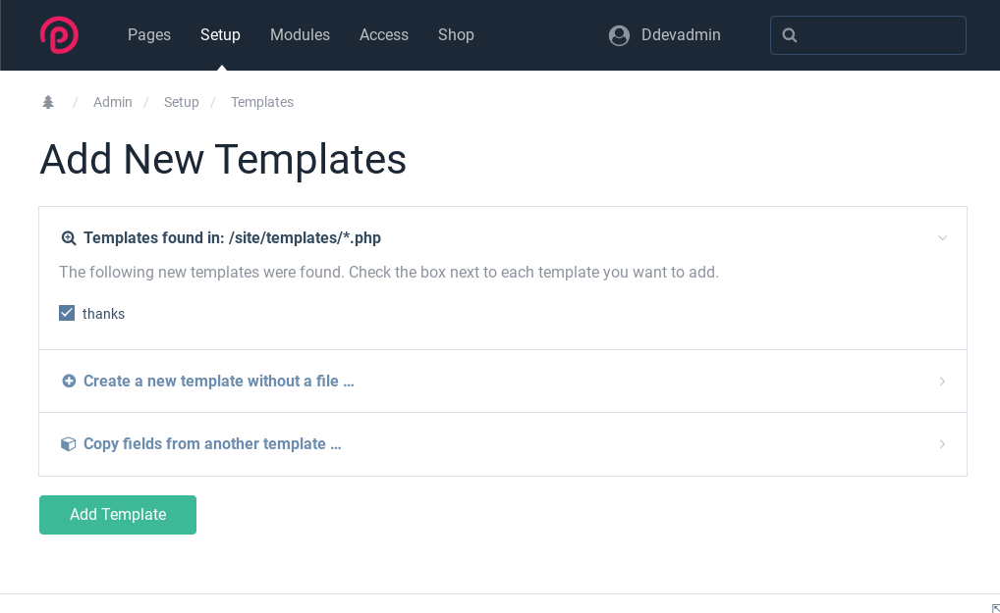  

Next, return to the Admin home, and create a child page under Home with the name `Thanks`, select the thanks template and publish it.  

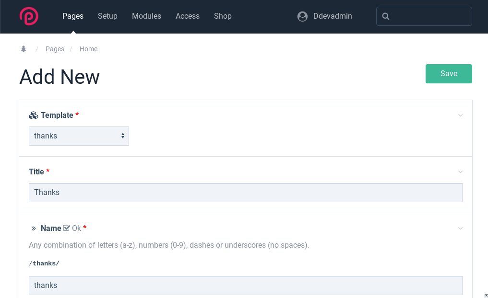 


Go to your browser and visit the `/thanks/` page. 

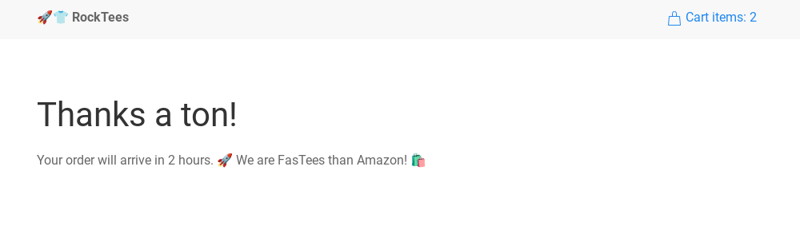 

Nice! we hve our thanks page ready, but… did you noticed that the cart still have items? Weird. That’s because we never reset it! The products will stay there as long as the customer doesn’t clear their browser’s local storage. To fix it, we can use the `rc-cart-reset` magic attribute.

You can place it anywhere, but let’s add it below our _delivery message_:

```html
<p>Your order will arrive in 2 hours. 🚀 We are FasTees than Amazon! 🛍️</p>
<!-- This line resets the cart! -->
<span rc-cart-reset></span>
```

Refresh your browser, and voilà! The cart has been reset.

If you need it, here’s the [site/templates/thanks.php](./src/thanks.php) version.


# 4. Testing the shop

And here we are, ready to test our brand new ecommerce:

[demo.webm](https://github.com/user-attachments/assets/16823fba-c3f2-467f-a39f-1379cd2c5c14)


We've reached the end. Nothing lasts forever, they say. 

# 5. Source

Just in case something isn’t working on, here are the final versions of our files, so you can copy and paste them.

- [site/rockcommerce.php](./src/rockcommerce.php)
- [site/classes/ProductPage.php](./src/ProductPage.php)
- [site/templates/home.php](./src/home.php)
- [site/templates/thanks.php](./src/thanks.php)
