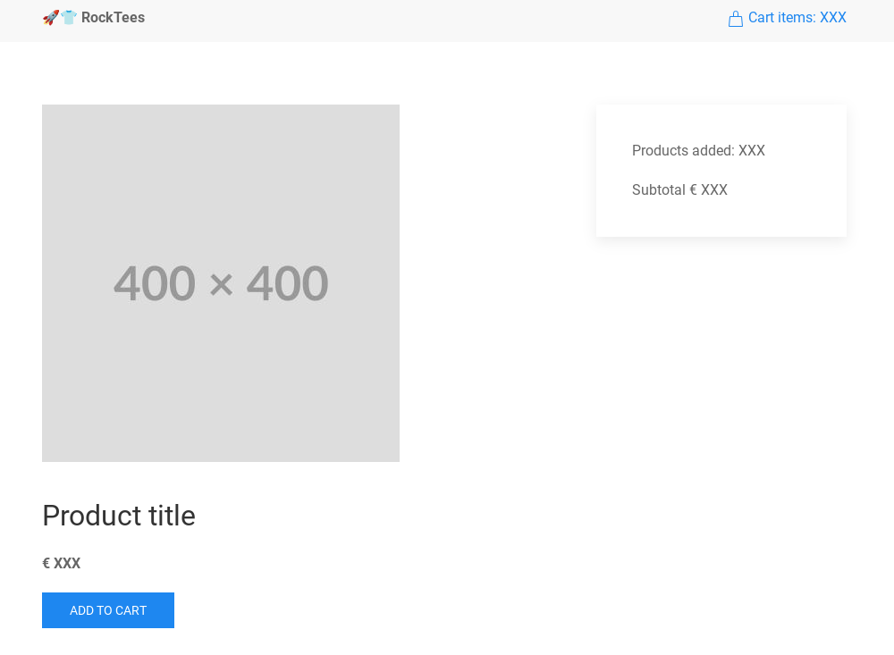
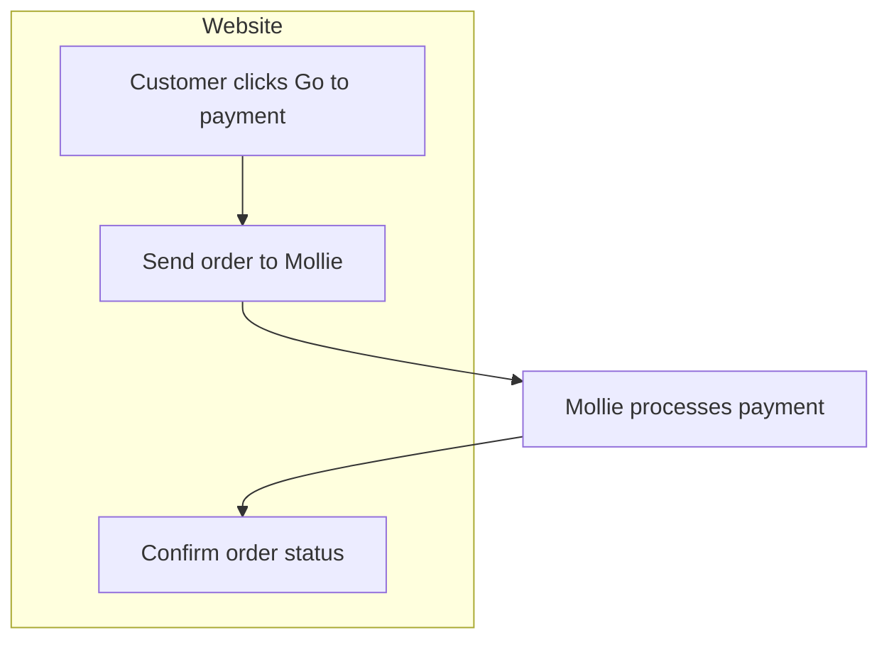
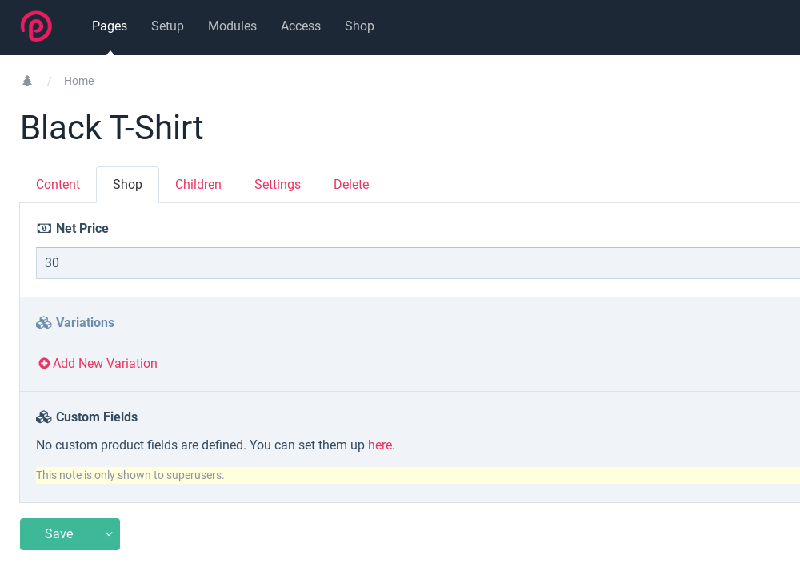
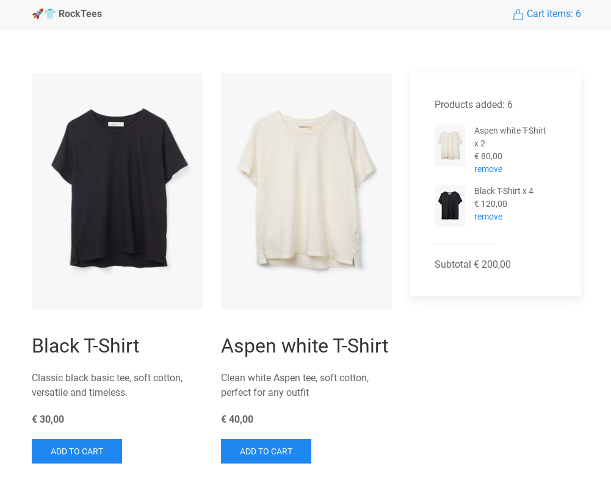

- [1. Intro](#1-intro)
- [2. (WIP) Part 1: Installing RockCommerce](#2-wip-part-1-installing-rockcommerce)
- [3. Part 2: Setup the store products and cart](#3-part-2-setup-the-store-products-and-cart)
  - [3.1. Add RockCommerce to the Frontend](#31-add-rockcommerce-to-the-frontend)
  - [3.2. Add Products](#32-add-products)
    - [3.2.1. Create the Product Template](#321-create-the-product-template)
    - [3.2.2. Add a Product page](#322-add-a-product-page)
    - [3.2.3. Convert the Product Page into a RockCommerce Product](#323-convert-the-product-page-into-a-rockcommerce-product)
  - [3.3. Add Cart Features to Products](#33-add-cart-features-to-products)
    - [3.3.1. Display Products in the Cart](#331-display-products-in-the-cart)
- [4. Part 3: The Payment](#4-part-3-the-payment)
  - [4.1. Use Mollie as a Payment Service Provider](#41-use-mollie-as-a-payment-service-provider)
    - [4.1.1. Install RockMollie](#411-install-rockmollie)
  - [4.2. Processing the Payment](#42-processing-the-payment)
  - [4.3. The Thanks Page](#43-the-thanks-page)
  - [4.4. (WIP) Testing the payment](#44-wip-testing-the-payment)
- [5. Bonus Track: Customize RockCommerce](#5-bonus-track-customize-rockcommerce)
  - [5.1. Add Product Image and Description](#51-add-product-image-and-description)
  - [5.2. Updating the products markup](#52-updating-the-products-markup)
  - [5.3. Updating the cart products](#53-updating-the-cart-products)
    - [5.3.1. Add the Missing Data](#531-add-the-missing-data)
- [6. Source](#6-source)


# 1. Intro

The day has finally arrived! You need to build an ecommerce site. You’ve never done it before, but obviously, as the ProcessWire lover you are, there’s no way you’re Shopify-ing or Magento-ing your way into this. Nope, you want to do it yourself.  

What if I told you (*crescendo music kicks in*) you could create a shop, right here, right now, in less than an hour? 

Introducing: 
[RockCommerce](https://www.baumrock.com/en/processwire/modules/rockcommerce/), the ProcessWire way to do ecommerce.  


Jokes aside, yeah, we’re building a shopping cart using the brand-new, shiny, and absolutely lovely Bernhard module. Here’s what we’ll do:

- **Frontend Store:** The interface to display, add, and remove products.
- **Payment:** And yes, we’ll process the cart products and handle the payment.

To start, please [create a fresh ProcessWire installation](https://processwire.com/docs/start/install/new/) using the blank profile. 
Once you're done, come back here.  


# 2. (WIP) Part 1: Installing RockCommerce

# 3. Part 2: Setup the store products and cart

The first step is to set up the skeleton of our store, where we'll display the products and the cart. 

For this demo, we’ll use [UIkit](https://getuikit.com/docs/introduction) to quickly style the store. Of course, you’re free to use your favorite styling framework (*cough* Tailwind) or even some custom old-fashioned CSS.

Now, open `site/templates/home.php`, paste and save the following:  

```html
<?php namespace ProcessWire; ?>

<!doctype html>
<html lang="en">
  <head>
    <meta charset="UTF-8" />
    <meta name="viewport" content="width=device-width, initial-scale=1.0" />
    <!-- UIkit CSS -->
    <link rel="stylesheet" href="https://cdn.jsdelivr.net/npm/uikit@3.21.16/dist/css/uikit.min.css" />
    <!-- UIkit JS -->
    <script src="https://cdn.jsdelivr.net/npm/uikit@3.21.16/dist/js/uikit.min.js"></script>
    <script src="https://cdn.jsdelivr.net/npm/uikit@3.21.16/dist/js/uikit-icons.min.js"></script>
    <!-- Paste RockCommerce JS here -->
    
  </head>
  <body>
    <header class="uk-navbar-container uk-padding-small">
      <nav class="uk-container uk-container-small uk-flex ">
        <div class="uk-navbar-left uk-text-bolder">🚀👕 RockTees</div>
        <div class="uk-navbar-right">
          <a href="#" class="uk-text-primary"> 
            <span uk-icon="icon: bag"></span> Cart items: XXX
          </a>
        </div>
      </nav>
    </header>

    <main>
      <div class="uk-container uk-container-small uk-section">
        
        <div class="uk-grid uk-grid-column-medium">
        
          <!-- Products region -->
          <div id="products" class="uk-width-2-3">
            <div class="uk-grid uk-grid-medium uk-child-width-expand">
              <div>
                
                <h2>Product title</h2>
                <p><strong>€ XXX</strong></p>
                <a class="uk-button uk-button-primary" href="">Add to cart</a>
              </div>
            </div>
          </div>
          
          <!-- Cart region -->
          <div class="uk-width-1-3">
            <div id="cart" class="uk-card uk-card-default uk-card-body">
              <p>Products added: XXX</p>
              <p>Subtotal € XXX</p>
            </div>
          </div>
        
        </div>
      </div>
    </main>
    
  </body>
</html>

```

Nothing fancy here: We’re including UIkit in our head and defining the HTML skeleton with two regions:  the _products_, and the _cart_. 

Your current setup should look something like this:  

 


Before we move on, please open the `site/config.php` file and comment out this line, which appends the `_main.php` template to any render templates. It's usually very useful, but for this demo, we won't be using it:

```php
// $config->appendTemplateFile = '_main.php';
```

## 3.1. Add RockCommerce to the Frontend  

With RockCommerce installed and our basic html ready, we're just one step away from using RockCommerce. In your `site/templates/home.php` add this script at the end of the `head` tag instead of the `<!-- Paste RockCommerce JS here -->` message:  

```html
<script
    src="<?= $config->urls->siteModules ?>RockCommerce/dst/RockCommerce.min.js"
    defer></script>
```

Now, to test if it’s working, update the _Cart items: XXX_ line in the `header` tag with this one, which includes the magic attribute `rc-cart-count`. This attribute helps us display how many products have been added to the cart:  

```html
<span uk-icon="icon: bag"></span> Cart items: <span rc-cart-count></span>
```

And also, update add the Magic attribute to the cart region:

```html
<p>Products added: <span rc-cart-count></span></p>
```

Head to your browser, and if you see `Cart items: 0` in both sections, congratulations, we’re set! If not... well, go back and check what you missed. That’s the charm of tutorials, isn’t it?

So, *What’s happening here?* In a nutshell, RockCommerce sets up endpoints on our website to handle products, carts, and orders. Then in the frontend it uses [Alpine](https://alpinejs.dev/) as a bridge to give us access to whatever product, cart, or order info we need.

This means the logic, flow and the interface are all up to us! It’s not one of those boxed, ready-to-go solutions where you have to hammer things here and there to make it fit your needs.

**Disclaimer:** That’s how I understand RockCommerce—it doesn’t mean it’s the official explanation. Hopefully, I’m not wrong! 😅

So, now that we have the pasta, let's add some salsa:


## 3.2. Add Products  

Unilaterally, I’ve decided we’re going to sell T-Shirts. Let’s set the foundation for our T-Shirt products by creating a product template.  

### 3.2.1. Create the Product Template  

1. Go to **Setup > Templates > Add New**.  
2. Type `product` as the name of the template and click **Add Template**.  

 


### 3.2.2. Add a Product page 

1. Head to the homepage of the admin panel and, in the page tree, click **Home > New**.  

  

2. Select the template `product`, give the page the title **Black T-Shirt**, and hit **Save + Publish**.  

  


### 3.2.3. Convert the Product Page into a RockCommerce Product

To convert our product page into a RockCommerce product, we will use a Custom Page Class and the `\RockCommerce\Product` trait.

First, create a new file and copy this code into it. Save the file as `site/classes/ProductPage.php`:

```php
<?php

namespace ProcessWire;

class ProductPage extends Page
{
  use \RockCommerce\Product;
}
```

> Tip: [Custom Page Classes](https://processwire.com/blog/posts/pw-3.0.152/#new-ability-to-specify-custom-page-classes) let us interact with pages in a more organized and _classy way_—pun intended—by introducing Object-Oriented Programming. Without them, we (or just me?) end up dumping a bunch of logic and code into templates, making things messier and more complex.  
> If you're not using classes yet, I beg you: give them a try!


This Custom Page Class is connected to our product page template, which means any page using that template will automatically become a RockCommerce product.

To prove it:

1. Go to the ProcessWire admin and click `Modules > Refresh`.
2. Open your product page in the admin and check out the new `Shop` tab.

Congratulations—your product page is officially a RockCommerce product!

  


So, to wrap up our products, enter `30` (or whatever value you prefer) as the price of our Black T-Shirt in the `Net Price` field. Then, please create another product:

- **Title:** Aspen White T-Shirt  
- **Price:** 40 (in the Shop tab)

> Tip: By default, the currency is set to Euro. To change it, go to `Modules > Site > RockMoney`.


Finally, hit `publish` (or the road Jack!).


## 3.3. Add Cart Features to Products

So far, we’ve got RockCommerce running and two shiny products ready to sell. To give our future customers a smooth, AJAX-like shopping experience, actions like adding/removing products, updating the cart, and navigating through checkout will be powered by **Alpine**. Luckily, RockCommerce handles most of the heavy lifting for us.

Let's start by replacing the placeholder content and loading real product data. 

Update the `Product` region in your `site/templates/home.php` file with the following:

```php
<!-- Products region -->
<div id="products" class="uk-width-2-3">
  <div class="uk-grid uk-grid-medium uk-child-width-expand">

    <?php foreach (pages('template=product') as $product): ?>
      <div <?= $product->rcAttributes() ?>>
        
        <h2><?= $product->title ?></h2>
        <p><strong><?= $product->rockcommerce_net ?></strong></p>
        <a class="uk-button uk-button-primary" href="#" @click='addToCart'>Add to cart</a>
      </div>
    <?php endforeach; ?>

    </div>
</div>
```

Now reload the homepage, try adding some products, and the counter will change. How cool is that?!

But hold your horses! Let’s review what’s happening here:

- We looped through all pages with the `product` template using `pages('template=product')` to display our two T-shirts.  
- For each product, we displayed its image, title, description, and price.  
- We addd the `$product->rcAttributes()` method to inject essential product data into each product `<div>` as attributes.  
- Finally, by using the `@click='addToCart'` dispatcher we made possible to add products to the cart with a single click.

Regarding  `rcAttributes()`—let me show you what it does. Right-click one of your T-shirts, inspect its code, and you’ll see something like this:  

```html
<div 
  x-data="RcProduct" 
  rc-pid="1034" 
  rc-price="30" 
  rc-minamount="1" 
  rc-maxamount="10" 
  rc-cid="1"
>
```

The `rcAttributes()` method dynamically injects product data that Alpine uses to handle the cart. So, when `@click='addToCart'` is triggered, it sends a request with that info to the `/rockcommerce/cart/add` endpoint, which in return updates the cart. That’s how our `rc-cart-count` counter increases!  

All of this happens just by adding `$product->rcAttributes()` and `@click='addToCart'` to our product. Neat!


### 3.3.1. Display Products in the Cart

Alright, so far, so good! Our customer can add products, but the products aren't showing up in the cart. Let’s add some markup to get a sense of how the cart will look:

```php
<!-- Cart region -->
<div class="uk-width-1-3">
  <div
    id="cart"
    class="uk-card uk-card-default uk-card-body"
    x-data="RcCart"
    rc-reload
  >
    <p>Products added: <span rc-cart-count></span></p>
    <template x-for="item in items">
      <div 
        x-init="console.log(item)"
        class="uk-flex uk-text-small">
        <div class="uk-width-1-4">
          
        </div>
        <div class="uk-width-3-4 uk-padding-small uk-padding-remove-top">
          Black T-Shirt x XXX<br />
          € XXX<br />
          <a href="#">remove</a>
        </div>
      </div>
    </template>
    <hr class="uk-divider-small" />
    <p>Subtotal € XXX</p>
  </div>
</div>
```

Go to your browser, refresh the page, add some products, and bam, there they are! our products with fake content!  

I don't want us to miss what’s important here, so let’s strip down the code and imagine it like this:

```html
<div
    x-data="RcCart" // Alpine component
    rc-reload       // Magic RockCommerce reload attribute
>
  <p>
    Products added: 
    <span rc-cart-count></span>       // Magic RockCommerce cart-count attribute
  </p>
  <template x-for="item in items">    // Loop for cart items  
    <div x-init="console.log(item)">  // Log item attributes 
      Cart items render here...
    </div>
  </template>
</div>
```

What we are doing is creating an _Alpine cart component_ `RcCart` and including the `rc-reload` magic attribute, which will reload cart data for us. Then, we loop through the `items` array, which contains the items added to our cart, so we can render each one.

And, as a bonus, we included `x-init="console.log(item)"` so we can peek inside each item. In other words, we are "opening the box" to understand which item properties are available and how we can render them.

Open the console, and you’ll see a `Proxy(Object)` for each T-shirt. Inside that object is all the product information Alpine can use to populate the cart. Since the cart is handled on the frontend, we’re not going to rely on PHP’s properties (e.g.: `$product->title`), like we did for the T-shirt display. Instead, with Alpine we can take care of rendering everything dynamically.  

Here’s an example of what the logged data looks like:

```json
{
    "id": 1053,
    "title": "Black T-Shirt",
    "description": "",
    "product": 1034,
    "amount": 1,
    "variation": "",
    "variationTableData": [],
    "url": "/black-t-shirt/#-amount:1",
    "shortUrl": "/black-t-shirt/",
    "pic": "",
    "itemNet": "€ 30,00",
    "itemVat": "€ 0,00",
    "itemGross": "€ 30,00",
    "totalNet": "€ 30,00",
    "totalVat": "€ 0,00",
    "totalGross": "€ 30,00"
}
```
Now we can use those properties to update our cart products. Please update the HTML in your cart region with this:

```php
<!-- Cart region -->
<div class="uk-width-1-3">
  <div
    id="cart"
    class="uk-card uk-card-default uk-card-body"
    x-data="RcCart"
    rc-reload
  >
    <p>Products added: <span rc-cart-count></span></p>
    <template x-for="item in items">
      <div
        x-init="console.log(item)" 
        class="uk-flex uk-text-small">
        <div class="uk-width-1-4"></div>
        <div class="uk-width-3-4 uk-padding-small uk-padding-remove-top">
          <span x-text="`${item.title} x ${item.amount}`"></span><br />
          <span x-text="item.totalNet"></span><br />
          <a href="#" @click="deleteItem(item.id)">remove</a>
        </div>
      </div>
    </template>
    <hr class="uk-divider-small" />
    <p>Subtotal <span x-text="itemsNet"></span></p>
  </div>
</div>
```

Head to your browser and test it. Now, we can fully add products and delete them! 


And again, if we clean up our code a bit, the key takeaways are: we rendered the item properties, displayed the cart total net (`itemsNet`), and, just like we used to add products, we included the `@click="deleteItem(item.id)"` dispatcher to remove products without sweating.

```php
<template x-for="item in items">
  // item.pic
  
  // item.title + item.amount   
  <span x-text="`${item.title} x ${item.amount}`"></span>
  // item.title + item.totalNet   
  <span x-text="item.totalNet"></span>
  // deleteItem dispatcher
  <a href="#" @click="deleteItem(item.id)">remove</a>
</template>
//itemsNet
<p>Subtotal <span x-text="itemsNet"></span></p>
```

# 4. Part 3: The Payment

One of the things I feared most about the DIY e-commerce concept was: *Okay, how am I going to make payments work?*  

So, since our demo store is already displaying products, and we can add and remove them from the cart, we’re going to take a shortcut. Instead of building a full checkout form (where we’d obviously capture customer details like name and address), we are going to grab the bull by the horns, and jump straight to the payment! 

Olé!

Under the cart region, right below the `<p>Subtotal <span x-text="itemsNet"></span></p>` line, create a payment button that’s disabled when the cart is empty and enabled when products are added:

```html
<form method="post" action="/payment/">
  <button
    type="submit"
    :class="count ? 'uk-button-primary' : 'uk-button-default'"
    :disabled="!count"
    class="uk-button">
      Go to payment
  </button>
</form>
```

As you see, it’s a plain and simple form that doesn’t actually submit any data—it just triggers the `/payment/` page.

## 4.1. Use Mollie as a Payment Service Provider

For this demo, we’re going to integrate [Mollie](https://my.mollie.com/dashboard/signup/2316011) (Affiliate-Link) because it’s easy, and Bernhard already [created the module](https://processwire.com/talk/topic/30529-rockmollie-integrates-mollie-payments-into-processwire/).

1. Start by creating a Mollie account at [sign-up link](https://www.mollie.com/signup).
2. Click "Online payments."


3. Copy the test key under "Test API key."


4. Add this to the end of your `site/config.php` file, making sure to replace `your API key` with the key you copied:

```php
$config->moduleInstall('download', 'debug');
$config->mollieApiKey = 'test_xxx'; //Paste your key here
```

### 4.1.1. Install RockMollie

1. Go to `Modules > New` in the ProcessWire admin.
2. Under `Add Module From Directory`, type `RockMollie`.
3. Click on `Get Module info`, then `Download Now`, and click on `Install Now`.

## 4.2. Processing the Payment

Okay, the logic here is pretty simple. When the customer hits the `Go to payment` button, we need to convert our cart products, into an order and pass the order information to Mollie so they can charge our customer. Then, Mollie will return the customer to our page and secretly pass us the hopefully-successful payment order information.

Here's a markdown diagram that illustrates the flow: 



Can you guess how much code we’d need to make that happen? Let's find out:

First, Please create the file `site/rockcommerce.php`. This file is a *hook file* provided by the module, where we can centralize all the hooks that modify RockCommerce's behavior.

> **Tip**: If you're not familiar with hooks, pause here and check out the [Using Hooks in ProcessWire](https://processwire.com/docs/modules/hooks/) documentation.

Now that we have it, let's paste our first hook:

```php
<?php namespace ProcessWire;

// Add a hook to handle form submissions at the '/payment/' URL
wire()->addHook('/payment/', function ($event) {
  // Create a new order using RockCommerce cart
  $order = rockcommerce()->cart()->createOrder('New Order');

  // Create a payment for the order and set '/thanks/' as the redirect URL after payment
  $payment = $order->createPayment('/thanks/');

  // If the payment was successfully created, redirect to the checkout URL
  if ($payment) {
    wire()->session->redirect($payment->getCheckoutUrl());
  } else {
    throw new WireException('Payment creation failed.');
  }
});
```

Second… no, there's no second step, just this hook. Really. 
I know! is so simple, yet powerful! 

Let me explain: First we intercept the URL `/payment/` request, using a [URL/Path hook](https://processwire.com/docs/modules/hooks/#url-path-hooks), so we dont need to create and extra payment page. Then we create a RockCommerce order, and with the order, we create a payment and pass `/thanks` as our redirection success page. And finally, we redirect the user to Mollie.

## 4.3. The Thanks Page

And to finish, we are going to create a simple thanks page, by ripping of the layout of our Home page. Please create a new file `site/templates/thanks.php` and paste this:

```html
<?php namespace ProcessWire; ?>

<!doctype html>
<html lang="en">
  <head>
    <meta charset="UTF-8" />
    <meta name="viewport" content="width=device-width, initial-scale=1.0" />
    <!-- UIkit CSS -->
    <link rel="stylesheet" href="https://cdn.jsdelivr.net/npm/uikit@3.21.16/dist/css/uikit.min.css" />
    <!-- UIkit JS -->
    <script src="https://cdn.jsdelivr.net/npm/uikit@3.21.16/dist/js/uikit.min.js"></script>
    <script src="https://cdn.jsdelivr.net/npm/uikit@3.21.16/dist/js/uikit-icons.min.js"></script>
    <!-- RockCommerce JS -->
    <script
      src="<?= $config->urls
        ->siteModules ?>RockCommerce/dst/RockCommerce.min.js"
      defer
    ></script>
  </head>
  <body>
    <header class="uk-navbar-container uk-padding-small">
      <nav class="uk-container uk-container-small uk-flex ">
        <div class="uk-navbar-left uk-text-bolder">🚀👕 RockTees</div>
        <div class="uk-navbar-right">
          <a href="#" class="uk-text-primary"> 
            <span uk-icon="icon: bag"></span> Cart items: <span rc-cart-count></span>
          </a>
        </div>
      </nav>
    </header>
    <main>
      <div class="uk-container uk-container-small uk-section">
        <h1>Thanks a ton!</h1>
        <p>Your order will arrive in 2 hours. 🚀 We are FasTees than Amazon! 🛍️</p>
      </div>
    </main>
  </body>
</html>
```

Now, go to the ProcessWire admin, navigate to **Setup > Templates > Add New**, and ProcessWire will prompt you to add the `Thanks` template.  

  

Next, return to the Admin home, and create a child page under Home with the name `Thanks`, select the thanks template and publish it.  

 


Go to your browser and visit the `/thanks/` page. 

 

Nice! we hve our thanks page ready, but… did you noticed that the cart still have items? Weird. That’s because we never reset it! The products will stay there as long as the customer doesn’t clear their browser’s local storage. To fix it, we can use the `rc-cart-reset` magic attribute.

You can place it anywhere, but let’s add it below our _delivery message_:

```html
<p>Your order will arrive in 2 hours. 🚀 We are FasTees than Amazon! 🛍️</p>
<!-- This line resets the cart! -->
<span rc-cart-reset></span>
```

Refresh your browser, and voilà! The cart has been reset.


## 4.4. (WIP) Testing the payment

And FINALLY! we can test our brand new ecommerce:

<!-- Todo: Update the video -->
[demo.webm](https://github.com/user-attachments/assets/1f7ac9ac-8400-47f9-8bc3-aecbf6838247)

# 5. Bonus Track: Customize RockCommerce

So, you thought I was going to leave you with a demo store without product photos? Come on! We act like RockStars here — we leave the best for the end of the concert!

If you noticed, by default, RockCommerce doesn’t force you to define products in any specific way. How they look or which fields they have is totally up to you, just like any ProcessWire page.

Which means, if we want to add product information, we first need to create the fields, attach them to the template, and then populate them..


## 5.1. Add Product Image and Description

To add an image and a description:

1. Go to `Setup > Fields > Add New`. Label it `Product Image` and choose `Single Image` for the field type.
2. Repeat the process for the description: Click `Setup > Fields > Add New`, label it `Product Description`, and select `Textarea` for the field type.


RockCommerce provides a repeater that will help us contain all of our custom fields. So, the easiest way to add these fields to a template is to open a product, like the `Black T-Shirt`, click on the `Shop Tab`, and then click the `here` link under the `Custom fields` section.



Add the new fields using the `Add Select` option, and hit `Save`.


Now, we can populate the product information. Go to the `Black T-Shirt` product page and add the image and description:

- **Image:** [Black T-shirt image](https://tailwindui.com/plus/img/ecommerce-images/product-page-01-related-product-01.jpg)
- **Description:** Classic black basic tee, soft cotton, versatile and timeless.
- **Price:** 30

And the same for the Aspen White T-Shirt:

- **Description:** Clean white Aspen tee, soft cotton, perfect for any outfit.
- **Image:** [Aspen T-shirt](https://tailwindui.com/plus/img/ecommerce-images/product-page-01-related-product-02.jpg)

And save them.

## 5.2. Updating the products markup

We have access the new fields via the repeater, eg: `rockcommerce_productfields->product_description`. Lets add both image and description to the template:

```html
<!-- Products region -->
<div id="products" class="uk-width-2-3">
  <div class="uk-grid uk-grid-medium uk-child-width-expand">

    <?php foreach (pages('template=product') as $product): ?>
      <div <?= $product->rcAttributes() ?>>
        <!-- Updated image -->
        rockcommerce_productfields->product_image->url ?>" />
        <h2><?= $product->title ?></h2>
        <!-- New description -->
        <p><?= $product->rockcommerce_productfields->product_description ?></p>
        <p><strong><?= $product->rockcommerce_net ?></strong></p>
        <a class="uk-button uk-button-primary" href="#" @click='addToCart'>Add to cart</a>
      </div>
    <?php endforeach; ?>

    </div>
</div>
```

Just regular Proceswire stuff until here.


## 5.3. Updating the cart products

To update the product image in the cart, we cannot use the same approach, because remember it is managed by Alpine, so we depend on the information available through the Items array object.

Go again to the console and inspect the item object. Notice anything? Yes, the `pic` and `description` are empty! That’s because RockCommerce doesn’t know about our image or description fields… yet.  

But no worries— with Processwire _you are always just a hook away from the solution_!

```json
{
    "id": 1053,
    "title": "Black T-Shirt",
    "description": "",
    "product": 1034,
    "amount": 1,
    "variation": "",
    "variationTableData": [],
    "url": "/black-t-shirt/#-amount:1",
    "shortUrl": "/black-t-shirt/",
    "pic": "",
    "itemNet": "€ 30,00",
    "itemVat": "€ 0,00",
    "itemGross": "€ 30,00",
    "totalNet": "€ 30,00",
    "totalVat": "€ 0,00",
    "totalGross": "€ 30,00"
}
```

### 5.3.1. Add the Missing Data  

Inside the file `site/rockcommerce.php`, add this hook:

```php
// Add a hook to modify the Items array
wire()->addHookAfter('Item::getJsonArray', function ($event) {
  $data = $event->return;

  // Get the product page using the ID in the data
  $product = wire()->pages->get($data['product']);
  if (!$product->id) {
    // Return if the product doesn't exist
    return;
  }

  if ($product->rockcommerce_productfields->product_image) {
    // Add the product image URL if it exists
    $data['pic'] = $product->rockcommerce_productfields->product_image->width(
      60
    )->url;
  }

  // Add the product description if it's available
  $data['description'] =
    $product->rockcommerce_productfields->product_description ?? null;

  // Set the modified data back to the event return
  $event->return = $data;
});
```

Reload the page, add some products―if you done have any in your cart, and check your console. 
Now the item data includes both image and description:

```json
{
    "id": 1053,
    "title": "Black T-Shirt",
    "description": "Classic black basic tee, soft cotton, versatile and timeless.",
    "product": 1034,
    "amount": 1,
    "variation": "",
    "variationTableData": [],
    "url": "/black-t-shirt/#-amount:1",
    "shortUrl": "/black-t-shirt/",
    "pic": "/site/assets/files/1034/product-page-01-related-product-01.60x0.jpg",
    "itemNet": "€ 30,00",
    "itemVat": "€ 0,00",
    "itemGross": "€ 30,00",
    "totalNet": "€ 30,00",
    "totalVat": "€ 0,00",
    "totalGross": "€ 30,00"
}
```

All that's left is to update the placeholder image with `item.pic` and remove the console message:

```html
<!-- Cart region -->
<div class="uk-width-1-3">
  <div
    id="cart"
    class="uk-card uk-card-default uk-card-body"
    x-data="RcCart"
    rc-reload
  >
    <p>Products added: <span rc-cart-count></span></p>
    <template x-for="item in items">
      <div class="uk-flex uk-text-small">
        <div class="uk-width-1-4"></div>
        <div class="uk-width-3-4 uk-padding-small uk-padding-remove-top">
          <span x-text="`${item.title} x ${item.amount}`"></span><br />
          <span x-text="item.totalNet"></span><br />
          <a href="#" @click="deleteItem(item.id)">remove</a>
        </div>
      </div>
    </template>
    <hr class="uk-divider-small" />
    <p>Subtotal <span x-text="itemsNet"></span></p>
  </div>
</div>
```

That looks good!

  


Now that we learned how to customize RockCommerce, we can say goodbye.
Nothing lasts forever, they say. 

# 6. Source

Just in case something isn’t working on, here are the final versions of our files, so you can copy and paste them.

- [site/rockcommerce.php](./src/rockcommerce.php)
- [site/classes/ProductPage.php](./src/ProductPage.php)
- [site/templates/home.php](./src/home.php)
- [site/templates/thanks.php](./src/thanks.php)
